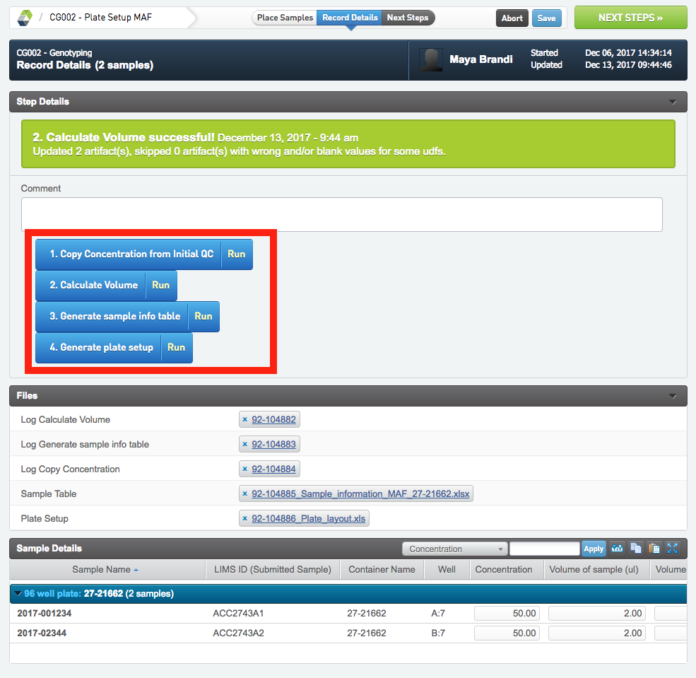
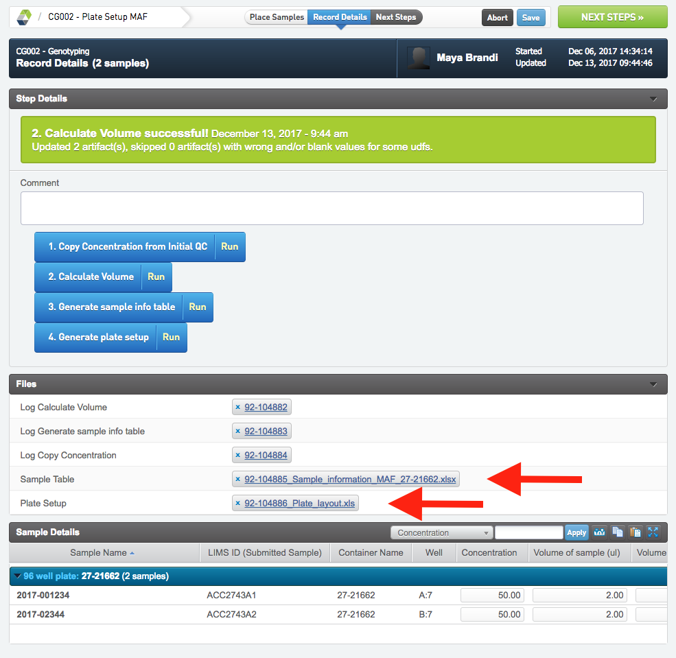

# Genotyping
There is only one protocol in the Genotyping workflow and it helps with setting up the plate and generating a submission template for MAF and keeps a record of when a plate has been sent for genotyping.

## Plate Setup MAF
During the Place Samples screen name the 96-well plate according to the MAF plate naming schema according to "ID#_FM3" where # is the serial number of the plate in progress. ID#_FM3 is the project ID of the plate, for more information see 1243 Method- Preparing plate for genotyping.

In the Record Details view press the blue buttons (marked by a red square in the image below) in the indicated order to calculate the Volume of sample (ul) and the Volume H20 (ul) to take for each sample in order to the get final concentration 4 nM. The total volume is indicated in the column "Final Volume (ul)" and will be either 25 ul, or if the sample concentration is too high, it will be 50 ul to avoid smaller pipetting volumes than 0.5 ul.

When pressing 3. Generate sample info table a file will be created and attached as "Sample Table" (indicated with a red arrow in the figure below). Pressing 4. Generate plate setup will create and attach the "Plate Setup" file. These two files contains the information needed to create a submission to MAF.

When done press the NEXT STEPS button to continue to the next step.

## Sent to MAF
When the plate has been prepared and has been sent off to MAF take the samples through this step. Just add the date and any comment in the Record Details screen and then Mark Protocol as Completed in the Next Steps view.

