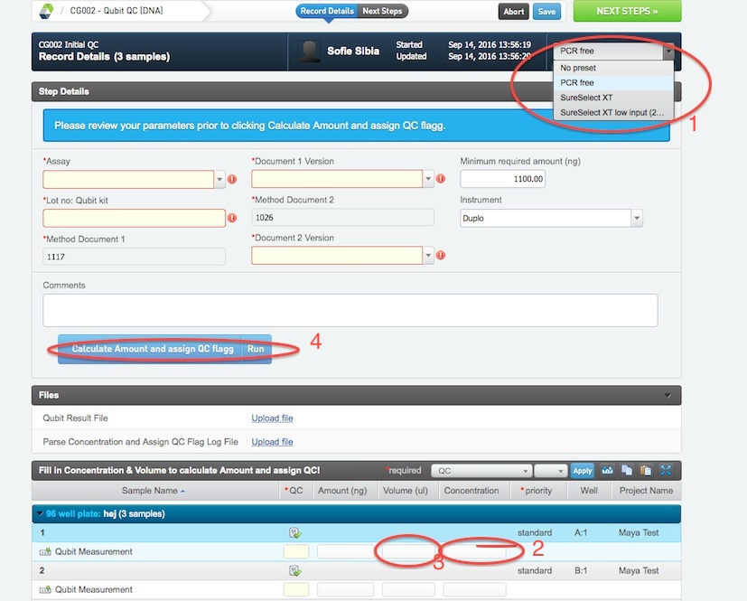
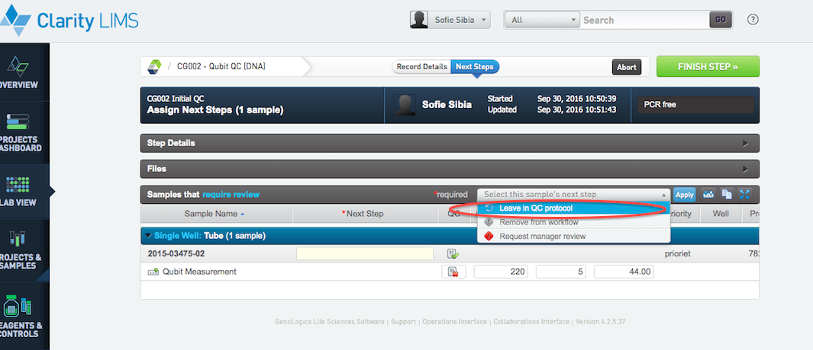
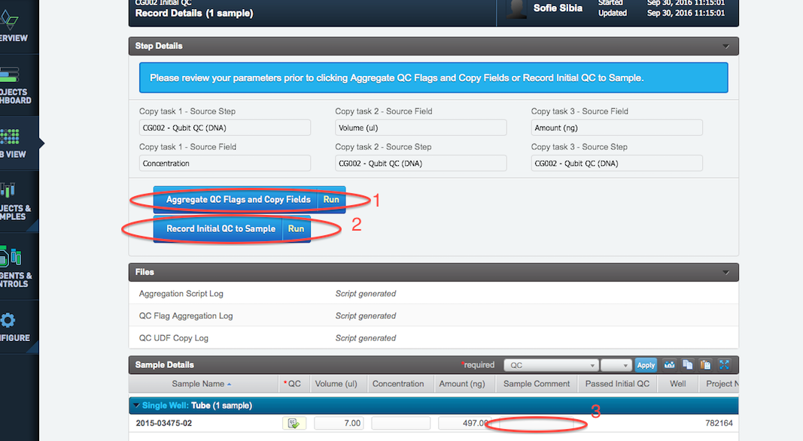

# Initial QC

## Reception Control.
* In the record details view press Set missing reads. This will set the UDF Reads missing (M), on each sample. The number is in million reads (not read pairs), and is fetched from the cg database. The reads can only be fetched if the sample has a application tag assigned to the UDF Sequencing Analysis. If the sample is missing this UDF or if it has a application tag that is not yet added to the database, the script will give an error. If this happens, trouble shoot or ask the LIMS administrator or team leader lab for assistance. The samples should be left in this stage while correcting the errors. 
* Press NEXT STEPS to proceed in the protocol.

## Qubit QC (DNA)

* Select PCR free from the pre set drop down menu (1)
* Fill in all required fields about lot numbers, assay method and document versions.
* Fill in the concentration for each sample obtained from either Qubit or Plate reader (2). If the plate reader been used upload calculation files.
* Fill in the volume of each sample (3)
* Press blue button to calculate amount and assign QC flag to samples (4)
* Press the green NEXT STEPS button located in upper right corner of the page
* If sample has not passed Qubit QC step, select "leave in QCprotocol". Then press the green FINISH STEP button in upper right corner of the page

## Aggregate QC (DNA)
The third and last step of the Initial QC is the Aggregate QC (DNA) step where the QC results are assigned to the sample and where the decision to move to sample preparation or not is made.

* Make sure that the preset is "Not RML".
* Press Aggregate QC flags and copy fields (1). This should populate the Amount (ng) and Volume (ul) fields in the sample Details table and set the QC flag.
* Press Record inital QC to sample (2). This is important as this will transfer the results from the QC step to the submitted sample in LIMS and to lablink.
* If it is needed to make a comment about a sample this can be done under the "sample comment" heading in the sample details bar (3). An example of a comment can be "sample had small amount of black material in the tube" or " ok to proceed" even though a red flag. You should also change the QC flag to green if you want to proceed with the sample anyway.
* Press the green FINISH STEP button up in the right hand corner. If all samples will move forward to library prep select "mark protocol as complete" otherwise ask laboratory manager for advice and removal of sample.

IF SAMPLES FAIL

 

If samples fail initial QC the first step to consider is if there is enough material to proceed anyway, use document

1662 Workflow and criteria WGA and TGA as a guideline. Always contact the customer to confirm before proceeding.  

 

Note: To the extent possible always do aggregate QC on entire projects. That is, wait until all samples of a project have been measured and are available in the aggregate QC queue before taking a decision. This will allow the user to be contacted more efficiently, and also make potential new sample submissions to be made once.