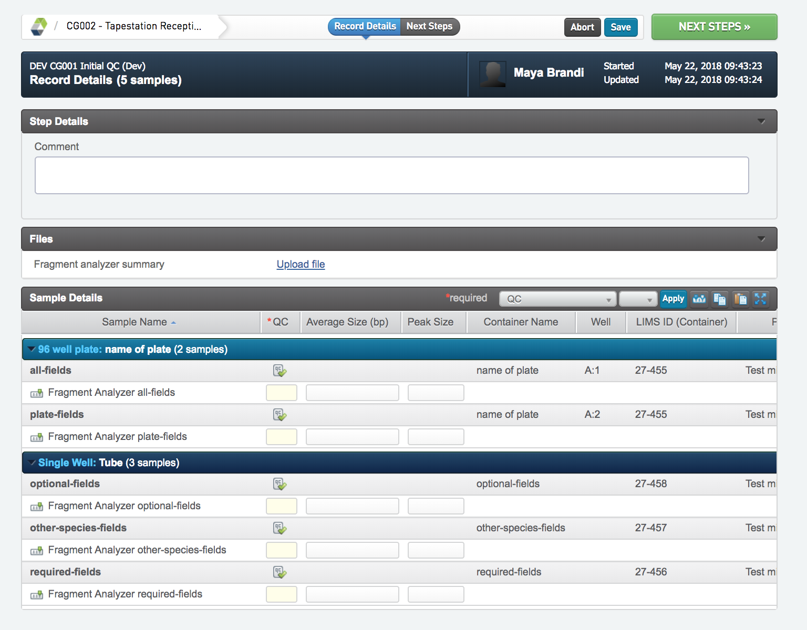
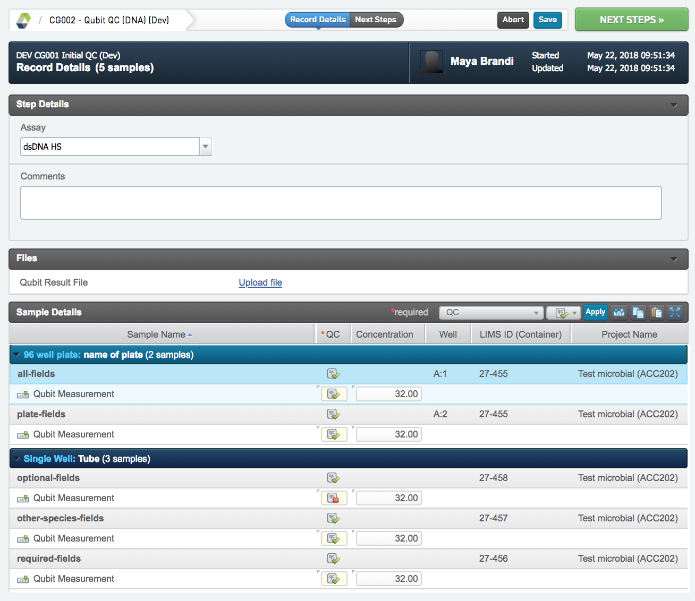
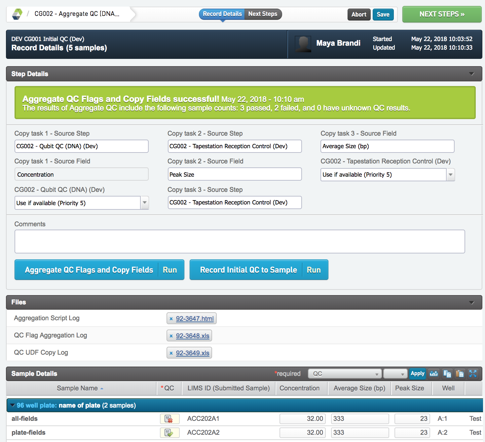

# Initial QC (Dev)

## Reception Control (Dev)
* In the record details view press Set missing reads. This will set the UDF Reads missing (M), on each sample. The number is in million reads (not read pairs), and is fetched from the cg database. The reads can only be fetched if the sample has a application tag assigned to the UDF Sequencing Analysis. If the sample is missing this UDF or if it has a application tag that is not yet added to the database, the script will give an error. If this happens, trouble shoot or ask the LIMS administrator or team leader lab for assistance. The samples should be left in this stage while correcting the errors. 
* Press NEXT STEPS to proceed in the protocol.

## Tapestation Reception Control (Dev)
* Write the average library size in Average Size (bp)  
* Write the peak size from the TP data in Peak Size
* Use the correct flag for each library using QC- flags
* Write any comments in Comments
* Press NEXT STEPS to proceed in the protocol.

## Qubit QC (DNA) (Dev)
* Write the measured concentrations in Concentration
* Write any comments in Comments
* Press NEXT STEPS to proceed in the protocol.

##  Aggregate QC (DNA) (Dev)
* Run Aggregate QC flags and copy fields. Concentration, Average Size (bp) and Peak Size are copied from previous steps, for all samples. 
* Write any comments in Comments 
* Run Record initial QC to sample.
* Go to NEXT STEP. If all samples will move forward to library prep select mark protocol as complete otherwise ask laboratory manager for advice and removal of sample.

