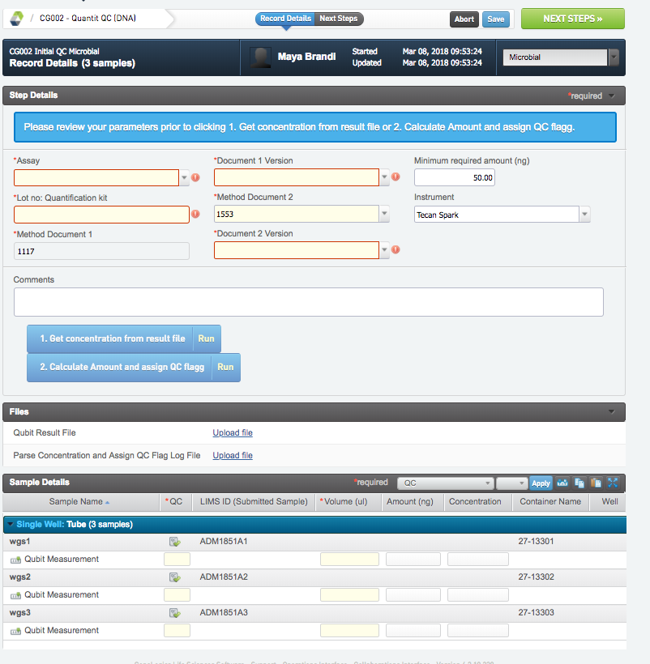
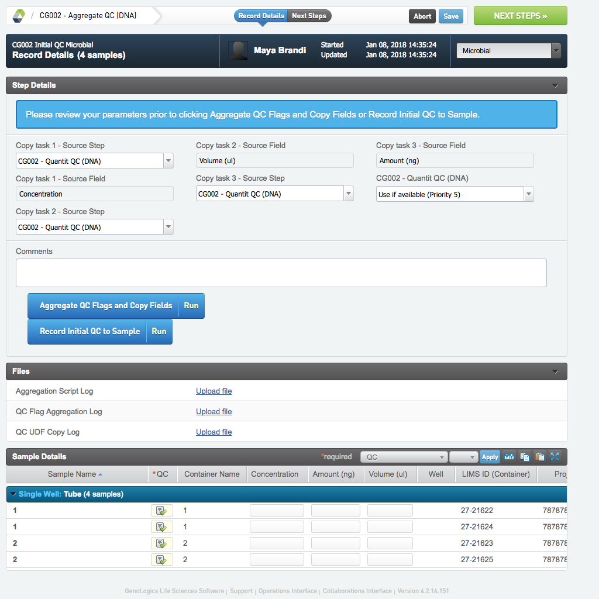

# Initial QC Microbial

## Reception Control 

* In the record details view press Set missing reads. This will set the UDF Reads missing (M), on each sample. The number is in million reads (not read pairs), and is fetched from the cg database. The reads can only be fetched if the sample has a application tag assigned to the UDF Sequencing Analysis. If the sample is missing this UDF or if it has a application tag that is not yet added to the database, the script will give an error. If this happens, trouble shoot or ask the LIMS administrator or team leader lab for assistance. The samples should be left in this stage while correcting the errors. 
* Press NEXT STEPS to proceed in the protocol.

## Quantit QC (DNA) 
* Make sure that the preset is set to Microbial. 
* Fill in all required fields.
* Upload the Qubit result file from the Plate reader.
* Run Get concentrations from result file to set the concentration UDFs for all samples.
* Fill in the volume of each sample
* Run Calculate Amount and assign QC flagg. The Amount (ng) field is populated for all samples.
* Go to NEXT STEP and FINISH STEP. If sample has not passed the QC step, select leave in QC protocol if you want to proceed with it.

## Aggregate QC (DNA)

* Make sure that the preset is set to Microbial.
* Run Aggregate QC flags and copy fields. Concentration, Amount (ng) and Volume (ul) are copied from previous steps, for all samples. 
* Run Record initial QC to sample.
* Go to NEXT STEP. If all samples will move forward to library prep select mark protocol as complete otherwise ask laboratory manager for advice and removal of sample.

IF SAMPLES FAIL

 

If samples fail initial QC the first step to consider is if there is enough material to proceed anyway, use document

1662 Workflow and criteria WGA and TGA as a guideline. Always contact the customer to confirm before proceeding.  

 

Note: To the extent possible always do aggregate QC on entire projects. That is, wait until all samples of a project have been measured and are available in the aggregate QC queue before taking a decision. This will allow the user to be contacted more efficiently, and also make potential new sample submissions to be made once.