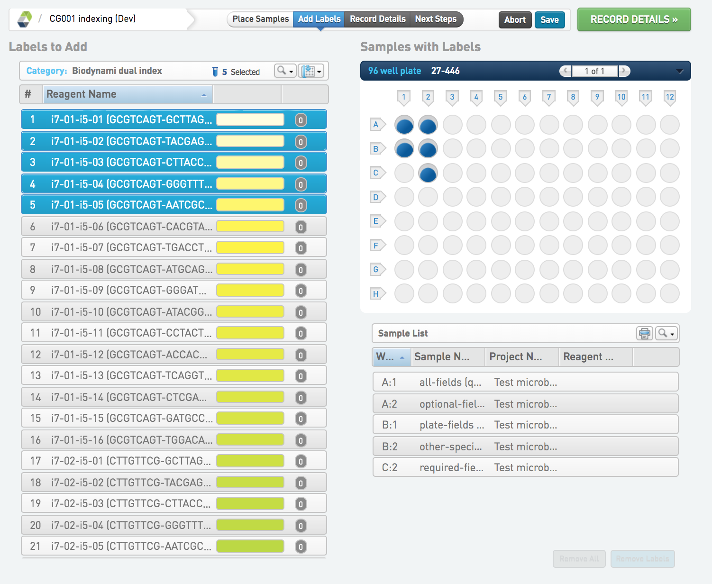
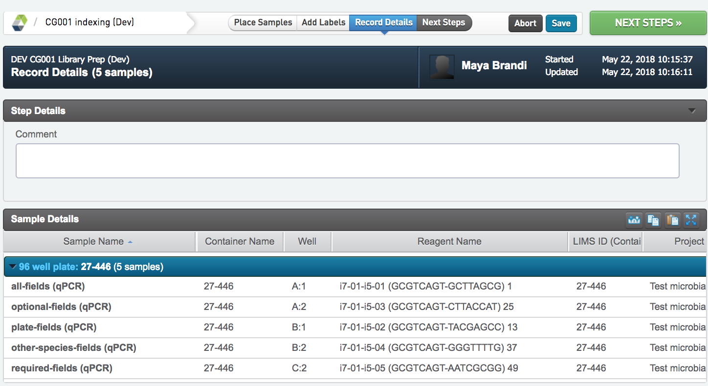

# Library Prep (Dev)

## Indexing (Dev)
* Place samples and select the correct index for each sample and klick RECORD DETAILS to continue.
* Write any comments in the Comments field.
* Go to NEXT STEP. Select if samples should be sent to the Pooling step, or directly sent to Library Preparation.

## Pooling (Dev)
* Drag the samples that should be pooled, to each respective tube symbol. Use the green "+" button to add extra tube(s). Each tube can also be re-named.
* Write any comments in the Comments field
* Go to NEXT STEP

## Library Prep (Dev)
* Write any comments in the Comments field
* Upload any files to file place holders
* Go to NEXT STEP

