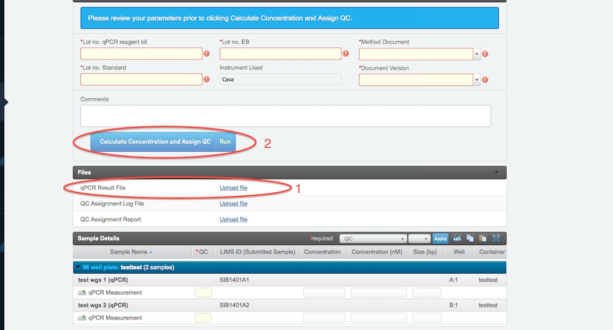

# Library validation QC

## Fragment analyzer
In this step the samples can be analyzed using tapestation or fragment analyzer.

* Place samples as they are placed in the sample prep plate, press record details button up in right hand corner
* Select the appropriate XT settings pre hyb in the drop down menu (1)
* Fill in all required fields
* Fill in the fragment size of each sample (2)
* Press the Assign QC flag button to get the QC flags assigned (3)
* Select NEXT STEP in upper right corner

## qPCR QC (Library Validation)

This step is pre set to only allow samples from the same plate to be handled at the same time. What this means is that a sample placed in A1 in library preparation plate will be assumed to be placed in A1 in the qPCR calculation, Sample placed in B1 in library preparation plate will be assumed to be placed in B1 in the qPCR calculation and so on.

If samples are in a tube format there is no such pre set and samples from different library preps can be mixed.

* Fill in all the required fields
* Upload the quantification summary sheet obtained from the qPCR (1). The sheet need to be opened from homer locally and be saved on a macbook before uploading.
* Calculate concentration and obtain QC flags by pressing the blue button (2).
* The size adjusted concentration will automatically be calculated and filled in under concentration (nM) for each sample. If outlyers are found in any of the dilution-series these are removed before the calculations are done. 
* A log file is generated. Open it to see details about witch dilution messurements were used when the calculations were performed.
* Once done press the green NEXT STEP button in upper right corner.
* If a sample has a red flag select still proceed with the sample to the NEXT STEP.

## Qubit QC

* Select the Pre hyb option in the pre set drop down menu (1)
* Fill in all the required fields
* Fill in the concentration for each sample (2)
* Press the blue Pre hyb QC-Calc amount and assign QC flags button (3)
* Press the green NEXT STEP button in upper right corner
 

## Aggregate QC (Library validation)
* In the upper right corner, select preset: PCR free (WGS) 
* Press the blue button "Aggregate QC flags and copy fields.
* Concentration (nM) is copied from CG002 - qPCR QC (Library Validation).
* Press the blue button Report Library QC to sample. This is important to remember so the results are reported to the submitted sample and can be used in following protocols.
* Press the green NEXT STEPS in the upper right corner
* If the sample has a red flag and needs to be reprepped chose "Rework from an earlier step". This can only be done by clicking the drop down menu of individual samples.

IF LIBRARIES FAIL

  

If libraries fail for the first time (and did not fail in initial QC) they should be reprepped. Go on to requeue the samples for library preparation using the requeueing samples feature described above or use the "rework from an earlier step" feature availble from the drop down menu in the NEXT STEP view. If the samples failed for the first time, but also failed in initial QC - the samples should not be reprepped. Consult Laboartory manager on how to proceed

If libraries fail for the second time (and no systematic errors such as instrument failure at scilifelab is suspected) they should be set as “mark protocol as complete” and proceed in the workflow after consultation with the Lab manager.
