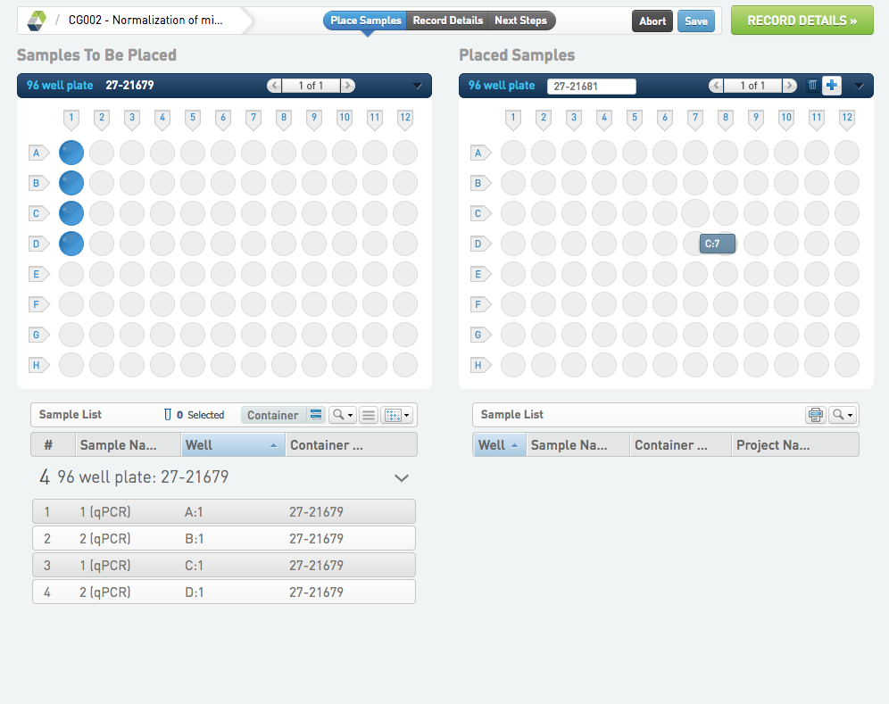
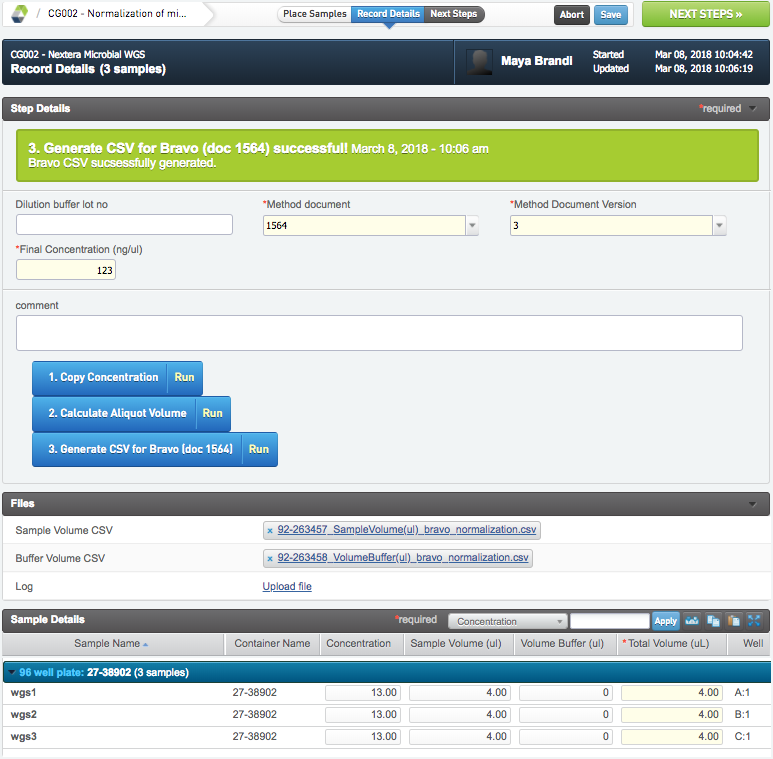
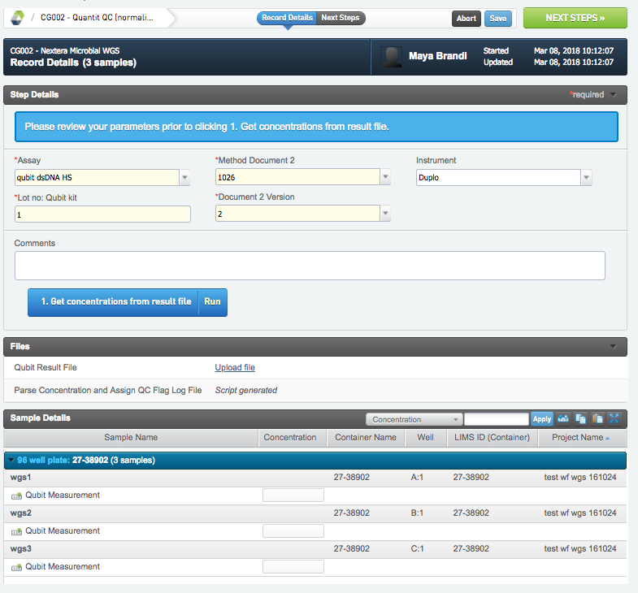
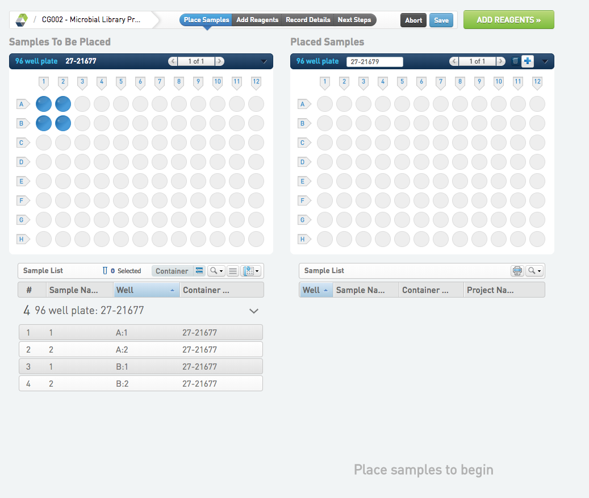
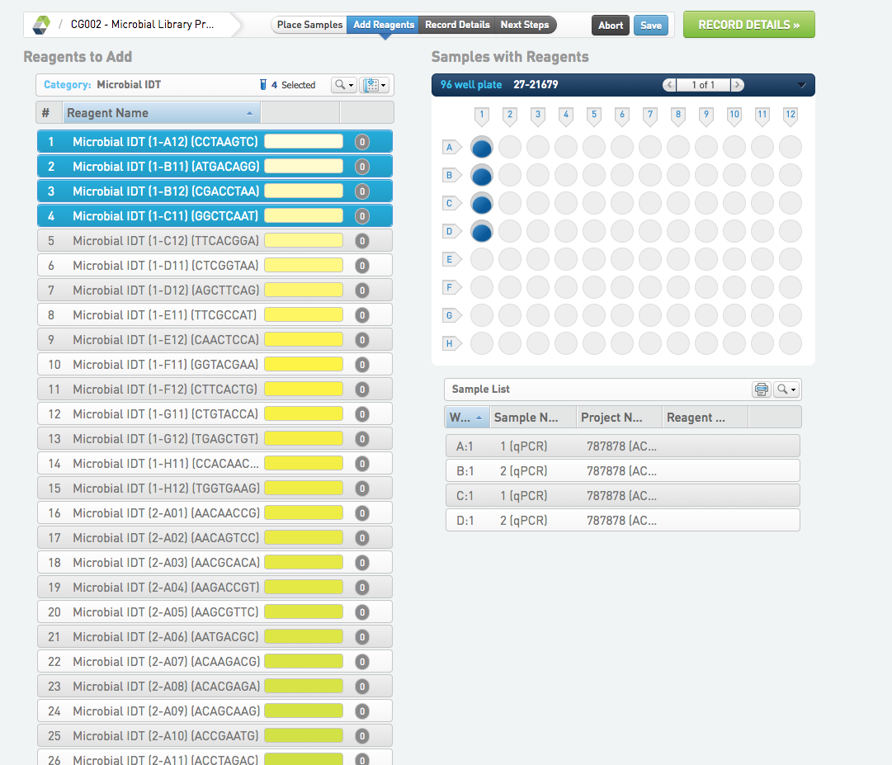
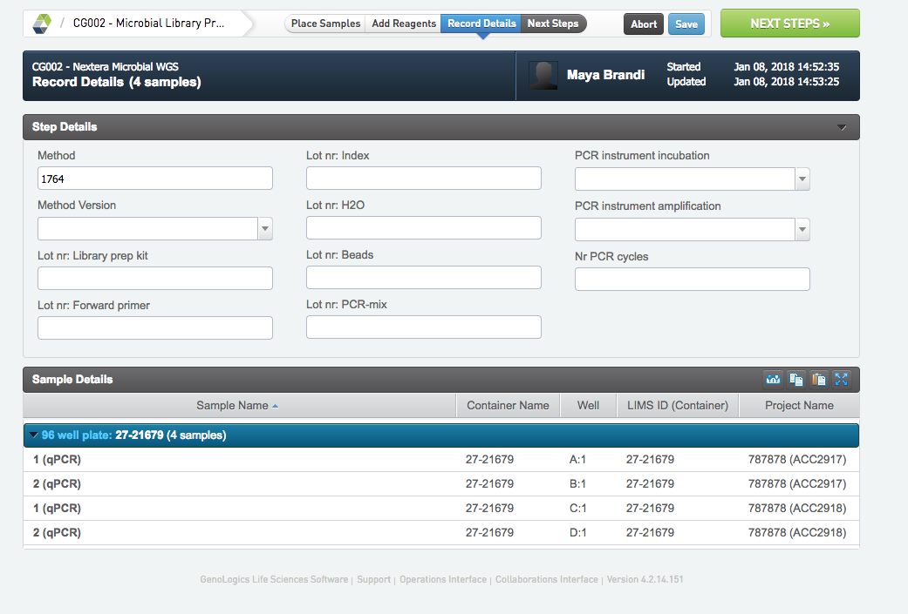

# Nextera Microbial WGS

## Normalization of microbial samples   

* Place the samples, name the plate and continue to RECORD DETAILS.
* Fill in all required fields.
* Run Copy Concentration.
* Run Calculate Aliquot Volume. Sample Volume (ul), Volume Buffer (ul) and Total Volume, are calculated and populated for all samples.
* Run Generate CSV for Bravo (doc 1564).  Two Bravo CSV files will be generated, one for sample volume and one for buffer volume.
* Go to NEXT STEP, select Quantit QC (normalization) and FINISH STEP. 

## Quantit QC (normalization)

* Fill in all required fields.
* Upload the result file from the Plate reader with concentrations.
* Run Get concentrations from result file to set the Concentration UDFs.
* Go to NEXT STEP, select Microbial Library Prep (Nextera) and FINISH STEP.

## Microbial Library Prep (Nextera) 

* Place the samples, name the plate and continue to ADD REAGENTS. 
* Add reagents and continue to RECORD DETAILS.
* Add relevant library prep info under Step Details.
* Go to NEXT STEP, select Mark protocol as complete and FINISH STEP.

