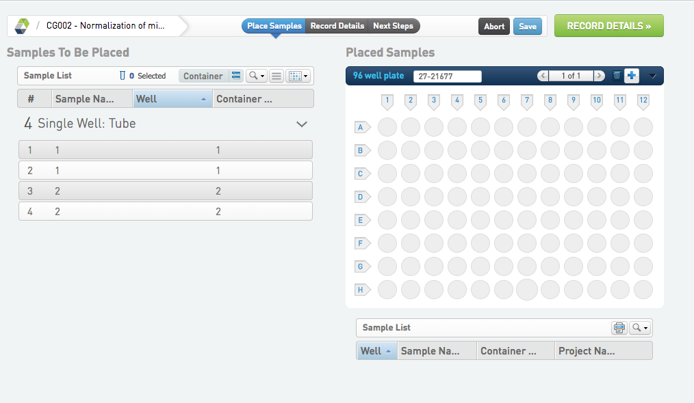
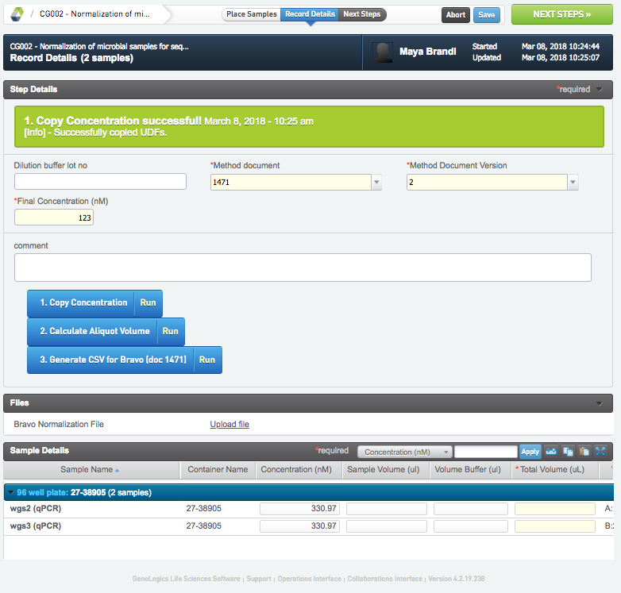

# Normalization of microbial samples for sequencing

## Normalization of microbial samples for sequencing

* Place the samples, name the plate and continue to RECORD DETAILS.
* Fill in all required fields.
* Run Copy Concentration.
* Run Calculate Aliquot Volume. Sample Volume (ul), Volume Buffer (ul) and Total Volume, are calculated and populated for all samples.
* Run Generate CSV for Bravo (doc 1471). A Bravo Normalization file will be generated and can be downloaded.
* Go to NEXT STEP, select Mark protocol as complete and FINISH STEP.

