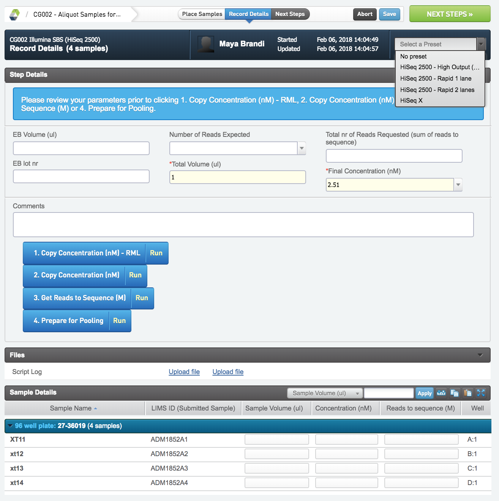

# RML Illumina SBS (HiSeq 2500)

## Sort HiSeq samples

This step sorts the pools into the Aliquote samples for Library pooling step. Just follow the intructions on the screen and proceed to theNEXT STEP.

## Aliquote samples for Library Pooling 

All RML pooles moves to the Aliquote samples for Library Pooling step from Sort HiSeq samples. This step is used to calculate the aliquote of pool to take to make a pool with a specific concentration and with the right composition regarding reads per pool. If sequencing a duo rapid flow cell only process one pool at a time.

* Start by selecting the application that the samples are going to be sequenced with from the drop down menu in the top right corner. This will decide the "Number of Reads Expected" and the "Final Concentration (nM)"  depending on what flow cell and how many lanes the pool will be sequenced in. If needed this can be manually changed.
* Next enter the total volume of the pool.
* Press Copy Concentration (nM ) - RML to copy concentration from previous step. 
* Press Get Reads to Sequence (M) to get the number of missing reads and populate the "Reads to sequence (M)" field. This is calculated from the amount of reads specified in the application tag minus the reads already sequenced (if the sample is being re-sequenced). If needed adjust manually.
* To calculate the EB volume and the individual sample volume press Prepare for Pooling. NB! If the sample volume is below 1 ul there will be a warning. Either increase the Total Volume or dilute the samples and adjust the sample concentration accordingly to increase the volume of the sample.
* When done press NEXT STEPS.

## Cluster Generation (Illumina SBS)
* In the queue view add the pools that you want to cluster and in the icebucket view under container select the "Illumina Flow cell Rapid Mode" if sequencing in rapid mode and the "Illumina Flow Cell" if sequencing in high output mode. If clustering on the HiSeq 2500 make sure to have 2 replicates of the pool to place in the flow cell in the "place sample" view.
* In the "place sample" view drag and drop the pools into the corresponding lane of the flow cell. Don't forget to change the name of the flow cell.
* In the "record details" view fill in the appropriate fields and press Generate SampleSheet CSV. This generates a sample sheet that you should download to the local computer for sample sheet generation according to 1038 To create a samplesheet for demultiplexing HiSeq runs.
* proceed to theNEXT STEP.

## Illumina Sequencing (Illumina SBS)

Start this step in LIMS before starting the sequencing on the machine. Only process one flow cell at a time in this step. Several flow cells can be processed in parallel.

* The fields in the "record details" view will for the most part be auto populated. Only fill in the RGT numbers for the reagent boxes.
* Press the blue save button and leave the page.
* When the run has finished resume the step from the lab view in LIMS. The sample table will now be filled in with QC data from the sequencing run.
* Check that everything has been filled in or make a note about it in the comment field. Then proceed to the NEXT STEP.

## Bcl Conversion & Demultiplexing (Illumina SBS)

Once the flow cell has been demultiplexed the Bcl Conversion & Demultiplexing (Ilumina SBS) can be started. Only process one flow cell at a time in this step.

* Fill in the method document for demultiplexing and the document version. Set the "Threshold for % bases >= Q30" to 80.
* Press the blue demultiplexing button. This will fetch the number of reads, % perfect index reads and %Q30 from the demultiplexing stats. If the data is not available for LIMS the numbers can be filled in manually.
* Then press the blue Set QC button to evalute the %Q30 threshold and set a QC flag.
* Proceed to the NEXT STEP.

## Sequence Aggregation

This step counts the number of reads a pool has gotten in total and summarizes the Missing Reads for easy evaluation of the need for resequencing or not.

* In the "record details" view press the blue Copy UDFs button to fetch the number of reads for the pool (this sums up the reads for all the samples in the pool) unless this is automatically initated when loading the page.
* Press the blue Aggregate reads (RML) button to add all reads from all flow cells the pool has been sequenced in.
* Press the blue Get Rerun Info button to calculate the number of missing reads. Note! The calculation is based on 75% of the total reads from the application tag, if this is reached 0 reads missing will be shown. However, if the pool did not reach this threshold, the actual number of missing reads in relation to 100% of the total reads from the application tag will be shown.
* Press the blue Report Sequencing QC to sample (RML) button before clicking the NEXT STEPS button. 
* This will automatically trigger the "rerun (RML)" script that will evalute the missing reads and tick the rerun box if more reads are needed. Press FINISH STEP to automatically send the samples to Delivery and Invoicing (section 2.2.4) or to be requeued in the Sort HiSeq samples step.

