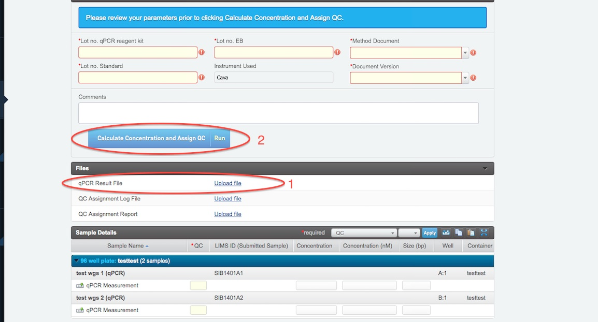

# RML Intial QC

The RML pools can be QCed either using Qubit or qPCR. If running pools from a new project and customer, always test on both Qubit and qPCR first. If Qubit is reliable for the library type proceed to primarily use that method for QC.

## Qubit QC RML
* Measure the concentration using Qubit according to 1026 Qubit - Instrument manual and type the volume adjusted concentration into the Concentration field for each pool.
* Add the fragment size estimated from customer bioanalyzer traces.
* Press the blue Convert concentration ng/ul to nM button to calculate the Concentration (nM) needed for sequencing. QC-flaggs will be failed if the concentration is less than 2 (nM).  Compare this to the customer supplied concentration and if the difference is large consult the lab manager on how to proceed.
* Proceed to the NEXT STEP.

## qPCR QC (Library Validation)

This step is pre set to only allow samples from the same plate to be handled at the same time. What this means is that a sample placed in A1 in library preparation plate will be assumed to be placed in A1 in the qPCR calculation, Sample placed in B1 in library preparation plate will be assumed to be placed in B1 in the qPCR calculation and so on.
If samples are in a tube format there is no such pre set and samples from different library preps can be mixed.

* Fill in all the required fields
* Upload the quantification summary shet obtained from the qPCR (1). The sheet need to be opened from homer locally and be saved on a macbook before uploading. NB! If running a manual qPCR the calulation will not work. Manully enter the calculations from the method 1031 qPCR procedure for NGS.
* Calculate concentration and obtain QC flags by pressing the blue button (2).
* The size adjusted concentration will automatically be calculated and filled in under concentration (nM) for each sample. If outlyers are found in any of the dilution-series these are removed before the calculations are done. 
* A log file is generated. Open it to see details about witch dilution messurements were used when the calculations were performed.
* The size adjusted concentration will automatically be calculated and filled in under concentration (nM) for each sample
* Once done press the green NEXT STEP button in upper right corner.
* If a sample has a red flag select still proceed with the sample to the NEXT STEP.

## Aggregate QC (DNA)
The third and last step of the Initial QC is the Aggregate QC (DNA) step where the QC results are assigned to the pools and where the decision to move to sequencing or not is made.

* Make sure that the preset is "RML".
* Press Aggregate QC flags and copy fields. This should populate the Concentration (nM) field in the sample Details table and set the QC flag.
* Press Record inital QC to sample. This is important as this will transfer the results from the QC step to the submitted sample in LIMS and to lablink.
* Press the green FINISH STEP button up in the right hand corner. 
