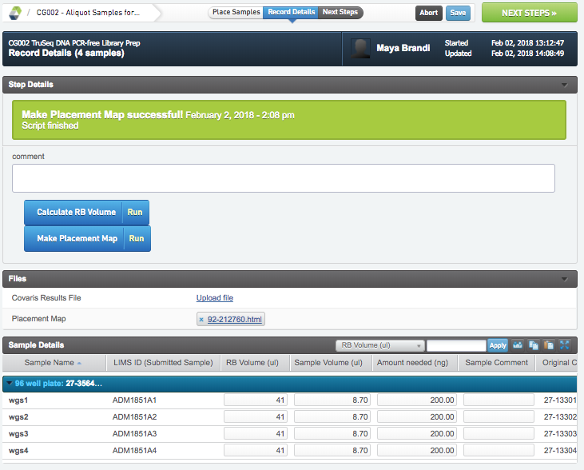
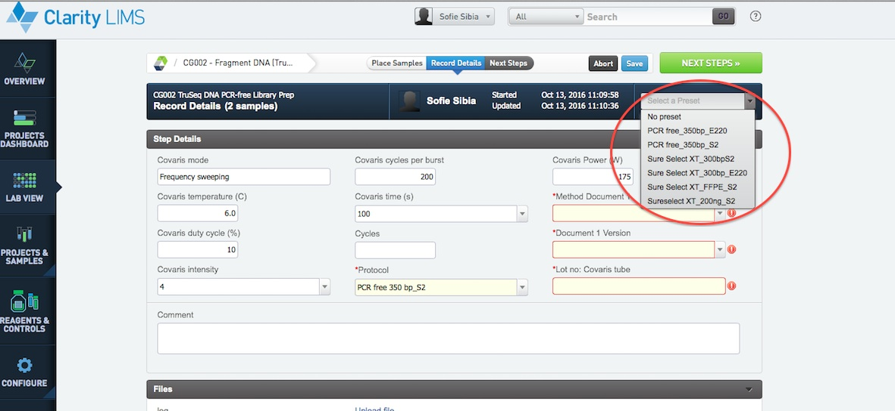

# SureSelect XT DNA prep

## Aliquot samples for covaris

* Select the amount needed for the method used under the heading "Amount needed (ng)" in the sample details tool bar.
* Press the blue button calculate EB Volume.
* The EB volume and Sample volume is calculated.
* Press Make Placement Map.
* A placement map is generated under Files.
* If any comment needs to be added to that in the comment box located on top.
* Once done press the green NEXT STEP button in upper right corner.

## Fragment DNA
* In the ice bucket setup, select if you are running the fragmentation step in a tube or well plate setting.
* If a well setting is used, place the samples the way they will be fragmented then click the green " Record details" button on top right.

* Select a preset in the drop down menu
* Fill in all the required fields and if needed make a comment
* Once done press the green NEXT STEP button on top right.

## End repair A-tailing and adapter Ligation (SS XT)
* Fill in all the required fields.
* Proceed to the NEXT STEP

## Amplify adapter ligated library (SS XT)
* Fill in all the required fields.
* Proceed to the NEXT STEP

