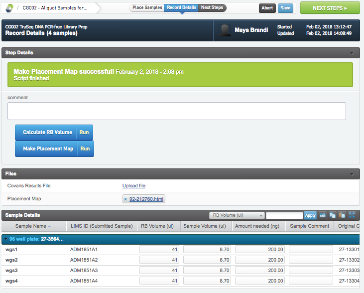
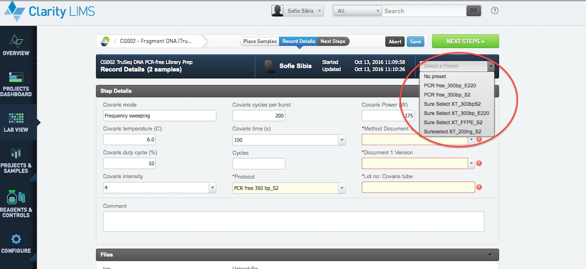

# TruSeq DNA PCR-free Library prep

## Aliquot samples for covaris

* Select the amount needed for the method used under the heading "Amount needed (ng)" in the sample details tool bar.
* Press the blue button calculate RB Volume
* The RB volume and Sample Volumes are calculated
* Press Make Placement Map.
* A placement map is generated under Files.
* If any comment needs to be added do that in the comment box located on top.
* Once done press the green NEXT STEP button in upper right corner.

## Fragment DNA
* In the ice bucket setup, select if you are running the fragmentation step in a tube or well plate setting.
* If a well setting is used, place the samples the way they will be fragmented then click the green " Record details" button on top right.

* Select a preset in the drop down menu
* Fill in all the required fields and if needed make a comment
* Once done press the green NEXT STEP button on top right.

## End repair Size selection A-tailing and Adapter ligation 
* In the ice bucket setup, select if you are running the library prep in a tube or well plate setting. Also select what index set you will use. "TruSeq DNA HT Dual-index (D7-D5)" is selected for samples with the TruSeq adaptors and "Lucigen index 8 bp" for samples prepared according to the Lucigen protocol.
* If a well plate setting is used, place the samples the way they will be prepared and name the plate WGSYYMMDD then click the green " Record details" button on top right
* Add an index to each sample by drag and drop, if you want to remove an index use the "remove reagents" button on bottom right, if you want to remove all indexes use the " remove all" button instead.
* Once done, click the green "record details" button on top right
* Fill in all required fields, make a comment if needad and click the green NEXT STEP button on top right.
* Mark the protocol as complete and FINISH STEP.
